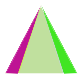
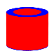
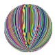

# css3-3d-shape-generator

Generate pure css3 3d shape, include html and css code.

# what can do

Create 3D CSS shapes below pretty easily：

+ cube 立方体 
+ pyramid 金字塔 
+ cylinder 圆柱体 
+ prism 棱柱 
+ sphere 球体 
+ fan 扇叶 
+ polyhedron 多面框 
+ ladder 梯 
+ ......

# how to use

Just visit [Shape Ganerator Page](http://tt-cc.cc/web-app/css3-3d-shape-generator/).

Maybe you need to tweak code slightly.